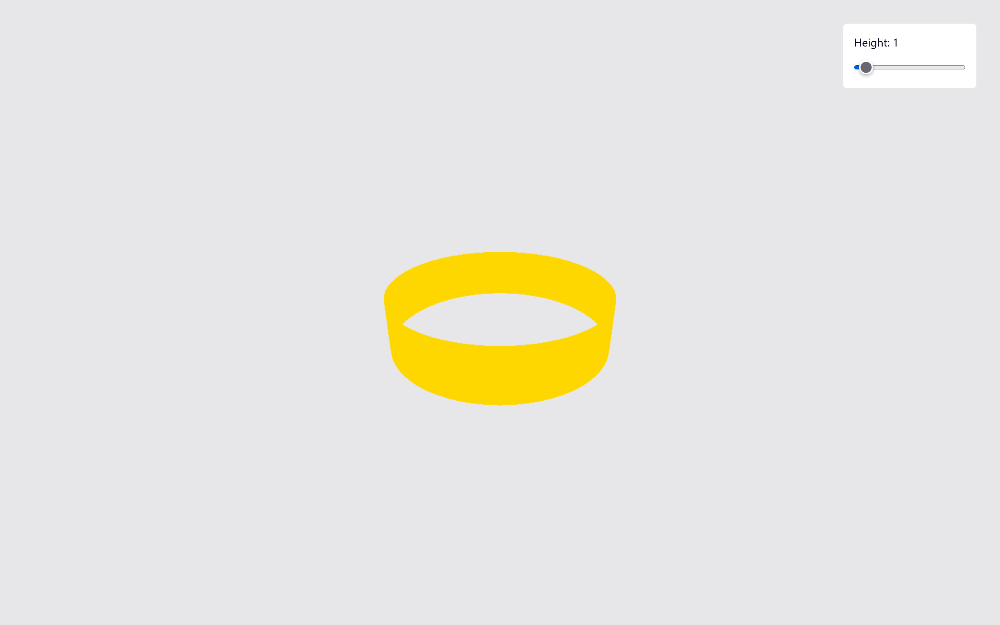

# Three.js (animation) -  3d ring




## Getting started

First you need [NodeJs](https://nodejs.org/en/download/) installed.
Clone this repo
```bash
git clone <repo link>
```
and run
```
yarn
```
to install the dependencies
Start the dev server by running
```
yarn run dev
```

## Mainly Built With

- [Three.js](https://threejs.org/) as the main framework
- and 2 cups of ☕ as fuel